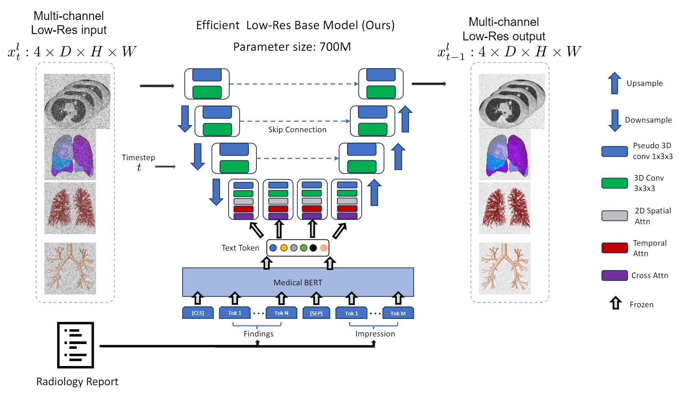
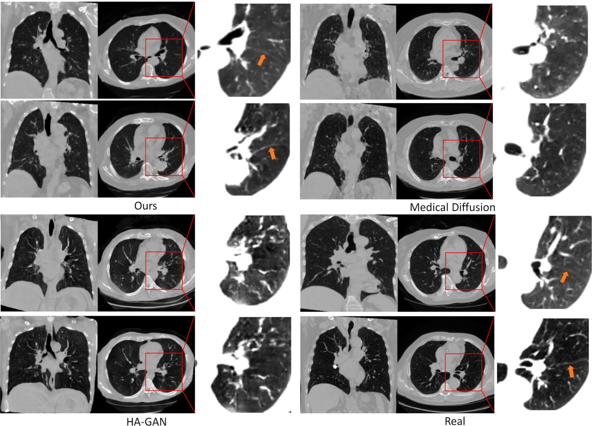
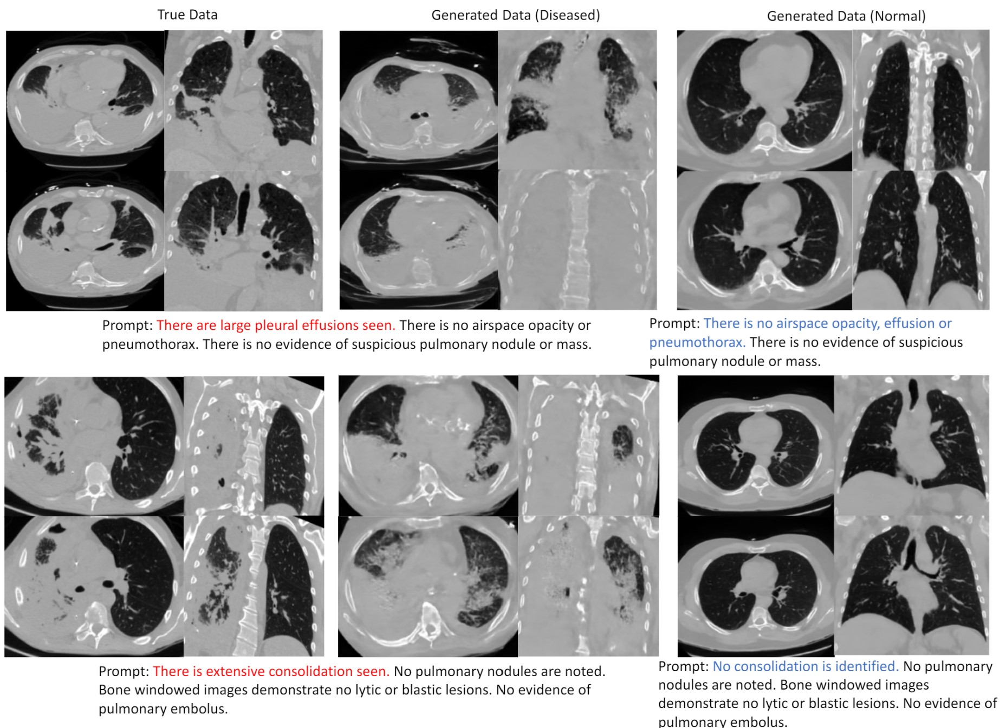
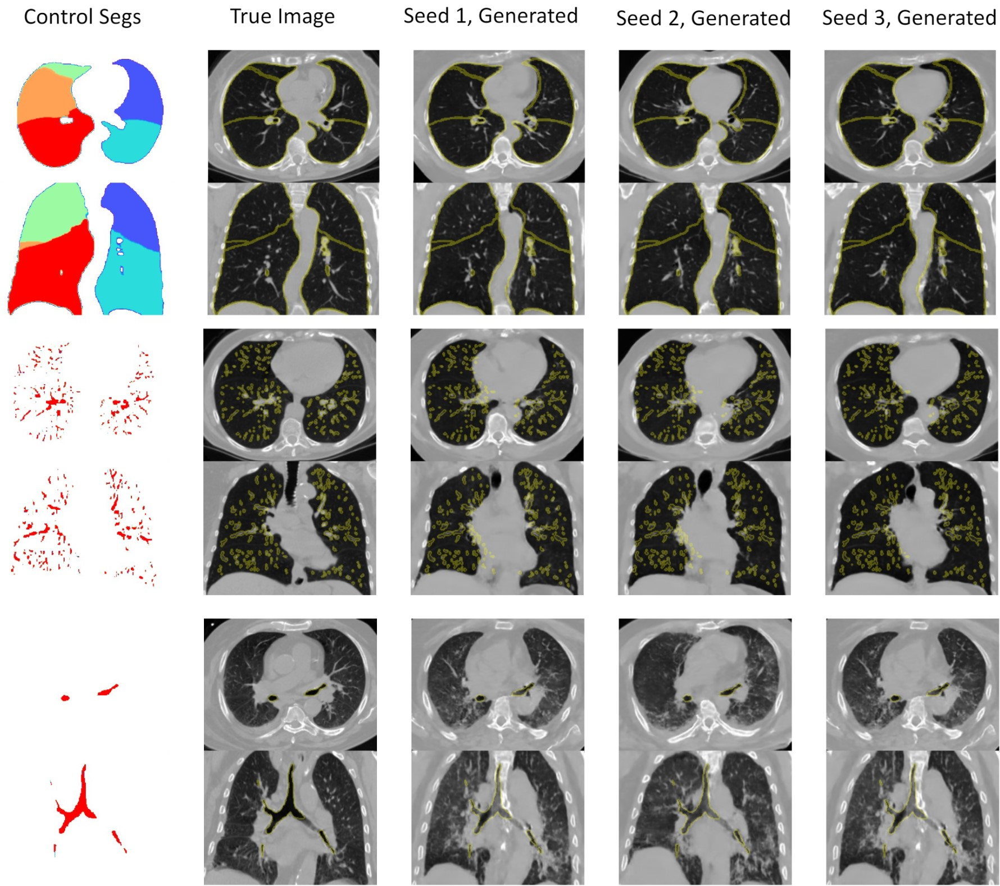

# MedSyn
Official PyTorch implementation for paper *MedSyn: Text-guided Anatomy-aware Synthesis of High-Fidelity 3D CT Images*, accepted by *IEEE Transactions on Medical Imaging*.

This code is made by [Yanwu Xu](http://xuyanwu.github.io) and [Li Sun](https://lisun-ai.github.io/).

### [[Paper](https://arxiv.org/abs/2310.03559)] [[Project](https://batmanlab.github.io/medsyn.github.io/)]

<p align="center">
  
</p>

## Table of Contents

1. [Environment Setup](#environment-setup)
2. [Pretrained Checkpoint](#pretrained-checkpoint)
3. [Pre-processing Data](#pre-processing-data)
4. [Training](#training)
5. [Inference](#inference)
6. [Additional Scripts](#additional-scripts)
7. [Generated Samples](#generated-samples)
8. [Citation](#citation)
9. [License and Copyright](#license-and-copyright)
10. [Contact](#contact)

## Environment Setup

Before running and doing inference based on our code, we highly recommend preparing at least two GPUs with 48G GPU memory each.

```
conda create -n medsyn python==3.9
```
In addition to this, you need to also install several packages by:

```
pip3 install -U xformers --index-url https://download.pytorch.org/whl/cu121
pip install monai==0.8.0
pip install accelerate
pip install einops
pip install einops_exts
```


## Pretrained Checkpoint

Refer to the `src` folder

Our checkpoint for pre-trained language model is available [here](https://www.dropbox.com/scl/fi/d6tg6si72nnjfa87vawsl/pretrained_lm.gz?rlkey=fcnyrmy1i3xi9frzjchc68kh3&st=gq6xofnh&dl=0).
Our checkpoint for model pre-trained on UPMC dataset is available [here](https://drive.google.com/file/d/1AAlEN_dB7C0aVMJ81mKBlYnSqMVOk-tl/) (Application required).

## Pre-processing Data

Refer to the `preprocess` folder

## Training

Refer to the `src` folder

This is a one-key running bash, which will run both low-res and high-res. But the training can be done independently
```bash
sh run_train.sh
```

## Inference

Refer to the `src` folder

`sh run_inference.sh`

## Additional Scripts

We give the inference for our text conditional generation in "prompt.ipynb" and the conditional generation with segmentation in "seg_conditional.ipynb"
## Generated Samples

| Low-Res|  High-Res
:-------------------------:|:-------------------------:
  |  
  |  

### Comparisons

<p align="center">
  
</p>

### Generation Conditioned on Reports

<p align="center">
  
</p>

### Generation Conditioned on Segmentation Mask

<p align="center">
  
</p>


## Citation

```
@ARTICLE{medsyn2024,
  author={Xu, Yanwu and Sun, Li and Peng, Wei and Jia, Shuyue and Morrison, Katelyn and Perer, Adam and Zandifar, Afrooz and Visweswaran, Shyam and Eslami, Motahhare and Batmanghelich, Kayhan},
  journal={IEEE Transactions on Medical Imaging}, 
  title={MedSyn: Text-guided Anatomy-aware Synthesis of High-Fidelity 3D CT Images}, 
  year={2024},
  doi={10.1109/TMI.2024.3415032}}
```

## License and Copyright

CC-BY-NC

## Contact
Yanwu Xu [yanwuxu@bu.edu],
Li Sun [lisun@bu.edu],
Kayhan Batmanghelich [batman@bu.edu]
