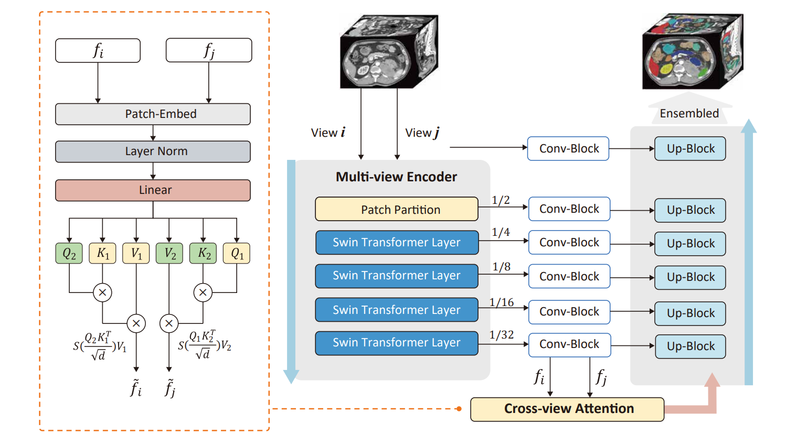
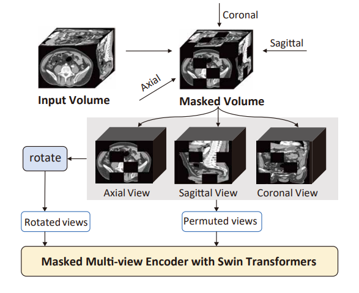
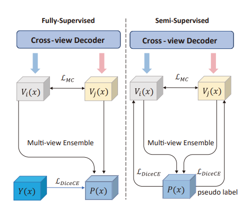
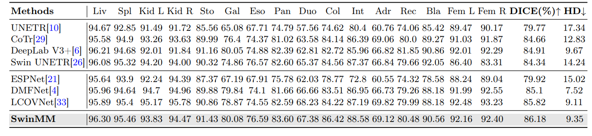

# SwinMM: Masked Multi-view with Swin Transformers for 3D Medical Image Segmentation

<p align="center">
  
</p>

## What is SwinMM?

Masked Multi-view with Swin Transformers, dubbed SwinMM, is the first comprehensive multi-view pipeline for self-supervised medical image analysis. SwinMM yields competitive performance, significantly lower training costs, and higher data efficiency compared to recent state-of-the-art models. SwinMM consists of two key components.

### Pretrain

In the pre-training stage, we introduce a masked multi-view encoder that simultaneously trains masked multi-view observations with a diverse set of proxy tasks. These tasks include image reconstruction, rotation, contrastive learning, and a mutual learning paradigm that comprehensively leverages hidden multi-view information from 3D medical data by maximizing the consistency between predictions from different views.

<p align="center">
  
</p>

### Finetune

In the fine-tuning stage, a cross-view decoder is developed to aggregate the multi-view information using a novel cross-view attention block.

<p align="center">
  
</p>

## Pre-trained Models

We present two checkpoints here:

- [pretrained_ckpt.pt](https://drive.google.com/file/d/1VFT1Oz5UGjAaXLdWAAdeD0mVeLyCQ0ry/view?usp=sharing)
- [WORD_finetuned_ckpt.pt](https://drive.google.com/file/d/1VFT1Oz5UGjAaXLdWAAdeD0mVeLyCQ0ry/view?usp=sharing)

Here is the sample testing result on WORD

<p align="center">
  
</p>

## Installation

Please check [INSTALL.md](INSTALL.md) for installation instructions.

## Evaluation

Testing can be done using the following scripts. Please change `pretrained_dir` and `pretrained_model_name` according to the path of the checkpoint you would like to test, and change `data_dir` and `json_list` according to the datasets.

```bash
cd WORD
python test_parrallel.py --pretrained_dir ./runs/multiview_101616/ \
	--pretrained_model_name model.pt \
	--distributed \
	--data_dir ./dataset/dataset12_WORD/ \
	--json_list dataset12_WORD.json
```

## Training

Please check [TRAINING.md](TRAINING.md) for training instructions.

## Acknowledgment

This work is partially supported by Google Cloud Research Credits program.
This Repo is based on [SwinUNETR](https://github.com/Project-MONAI/research-contributions/tree/main/SwinUNETR), [MONAI](https://monai.io/) and [bagua](https://github.com/BaguaSys/bagua).

## Citation

If you find this repository helpful, please consider citing:

```
@inproceedings{wang2023SwinMM,
  title     = {SwinMM: Masked Multi-view with Swin Transformers for 3D Medical Image Segmentation},
  author    = {Wang, Yiqing and Li, Zihan and Mei, Jieru and Wei, Zihao and Liu, Li and Wang, Chen and Sang, Shengtian and Yuille, Alan and Xie, Cihang and Zhou, Yuyin},
  booktitle = {MICCAI},
  year      = {2023}
}

@article{cardoso2022monai,
  title={Monai: An open-source framework for deep learning in healthcare},
  author={Cardoso, M Jorge and Li, Wenqi and Brown, Richard and Ma, Nic and Kerfoot, Eric and Wang, Yiheng and Murrey, Benjamin and Myronenko, Andriy and Zhao, Can and Yang, Dong and others},
  journal={arXiv preprint arXiv:2211.02701},
  year={2022}
}
```
