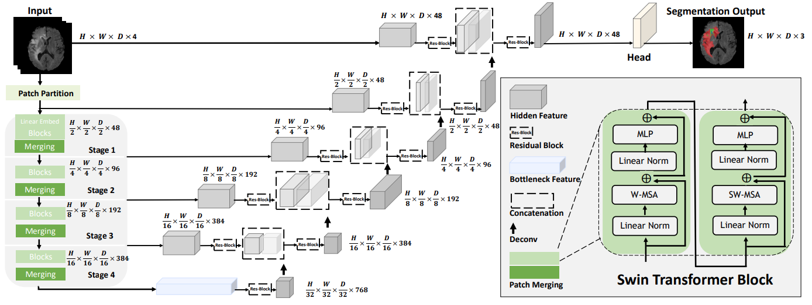
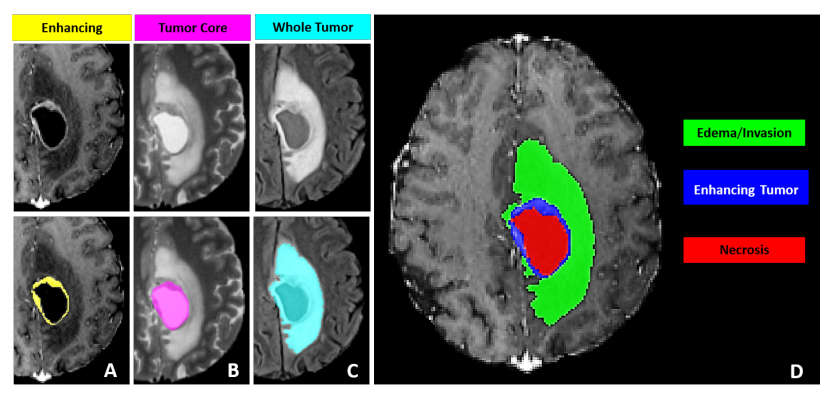

# Model Overview
This repository contains the code for [Swin UNETR](https://arxiv.org/pdf/2201.01266.pdf) [1,2] for the task of brain tumor  segmentation using the [BraTS 21](http://braintumorsegmentation.org/) challenge dataset [3,4,5,6]. Swin UNETR ranked among top-perfoming models in BraTS 21 validation phase. The architecture of Swin UNETR is demonstrated as below


# Tutorial
A tutorial for BraTS21 brain tumor segmentation using Swin UNETR model is provided in the following link.

[](https://colab.research.google.com/github/Project-MONAI/tutorials/blob/main/3d_segmentation/swin_unetr_brats21_segmentation_3d.ipynb)

# Installing Dependencies
Dependencies can be installed using:
``` bash
pip install -r requirements.txt
```

# Data Description

Modality: MRI
Size: 1470 3D volumes (1251 Training + 219 Validation)
Challenge: RSNA-ASNR-MICCAI Brain Tumor Segmentation (BraTS) Challenge

- Register and download the official BraTS 21 dataset from the link below and place then into "TrainingData" in the dataset folder:

  https://www.synapse.org/#!Synapse:syn27046444/wiki/616992

  For example, the address of a single file is as follows:

  "TrainingData/BraTS2021_01146/BraTS2021_01146_flair.nii.gz"


- Download the json file from this [link](https://drive.google.com/file/d/1i-BXYe-wZ8R9Vp3GXoajGyqaJ65Jybg1/view?usp=sharing) and placed in the same folder as the dataset.


The sub-regions considered for evaluation in BraTS 21 challenge are the "enhancing tumor" (ET), the "tumor core" (TC), and the "whole tumor" (WT). The ET is described by areas that show hyper-intensity in T1Gd when compared to T1, but also when compared to “healthy” white matter in T1Gd. The TC describes the bulk of the tumor, which is what is typically resected. The TC entails the ET, as well as the necrotic (NCR) parts of the tumor. The appearance of NCR is typically hypo-intense in T1-Gd when compared to T1. The WT describes the complete extent of the disease, as it entails the TC and the peritumoral edematous/invaded tissue (ED), which is typically depicted by hyper-intense signal in FLAIR [[BraTS 21]](http://braintumorsegmentation.org/).

The provided segmentation labels have values of 1 for NCR, 2 for ED, 4 for ET, and 0 for everything else.



Figure from [Baid et al.](https://arxiv.org/pdf/2107.02314v1.pdf) [3]

# Models
We provide Swin UNETR models which are pre-trained on BraTS21 dataset as in the following. The folds
correspond to the data split in the [json file](https://drive.google.com/file/d/1i-BXYe-wZ8R9Vp3GXoajGyqaJ65Jybg1/view?usp=sharing).

<table>
  <tr>
    <th>Name</th>
    <th>Fold</th>
    <th>Mean Dice</th>
    <th>Feature Size</th>
    <th># params (M)</th>
    <th>Download </th>
  </tr>
<tr>
    <td>Swin UNETR</td>
    <td>0</td>
    <td>88.54</td>
    <td>48</td>
    <td>62.1</td>
    <td><a href="https://github.com/Project-MONAI/MONAI-extra-test-data/releases/download/0.8.1/fold0_f48_ep300_4gpu_dice0_8854.zip">model</a></td>
</tr>

<tr>
    <td>Swin UNETR</td>
    <td>1</td>
    <td>90.59</td>
    <td>48</td>
    <td>62.1</td>
    <td><a href="https://github.com/Project-MONAI/MONAI-extra-test-data/releases/download/0.8.1/fold1_f48_ep300_4gpu_dice0_9059.zip">model</a></td>
</tr>

<tr>
    <td>Swin UNETR</td>
    <td>2</td>
    <td>89.81</td>
    <td>48</td>
    <td>62.1</td>
    <td><a href="https://github.com/Project-MONAI/MONAI-extra-test-data/releases/download/0.8.1/fold2_f48_ep300_4gpu_dice0_8981.zip">model</a></td>
</tr>

<tr>
    <td>Swin UNETR</td>
    <td>3</td>
    <td>89.24</td>
    <td>48</td>
    <td>62.1</td>
    <td><a href="https://github.com/Project-MONAI/MONAI-extra-test-data/releases/download/0.8.1/fold3_f48_ep300_4gpu_dice0_8924.zip">model</a></td>
</tr>

<tr>
    <td>Swin UNETR</td>
    <td>4</td>
    <td>90.35</td>
    <td>48</td>
    <td>62.1</td>
    <td><a href="https://github.com/Project-MONAI/MONAI-extra-test-data/releases/download/0.8.1/fold4_f48_ep300_4gpu_dice0_9035.zip">model</a></td>
</tr>

</table>

Mean Dice refers to average Dice of WT, ET and TC tumor semantic classes.

# Training

A Swin UNETR network with standard hyper-parameters for brain tumor semantic segmentation (BraTS dataset) is be defined as:

``` bash
model = SwinUNETR(img_size=(128,128,128),
                  in_channels=4,
                  out_channels=3,
                  feature_size=48,
                  use_checkpoint=True,
                  )
```


The above Swin UNETR model is used for multi-modal MR images (4-channel input) with input image size ```(128, 128, 128)``` and for ```3``` class segmentation outputs and feature size of  ```48```.
More details can be found in [1]. In addition, ```use_checkpoint=True``` enables the use of gradient checkpointing for memory-efficient training.

Using the default values for hyper-parameters, the following command can be used to initiate training using PyTorch native AMP package:
``` bash
python main.py
--feature_size=48
--batch_size=1
--logdir=unetr_test_dir
--fold=0
--optim_lr=1e-4
--lrschedule=warmup_cosine
--infer_overlap=0.5
--save_checkpoint
--val_every=10
--json_list='./jsons/brats21_folds.json'
--data_dir=/brats2021/
--use_checkpoint
--noamp
```

## Training from scratch on single GPU with gradient check-pointing and without AMP

To train a `Swin UNETR` from scratch on a single GPU with gradient check-pointing and without AMP:

```bash
python main.py --json_list=<json-path> --data_dir=<data-path> --val_every=5 --noamp \
--roi_x=128 --roi_y=128 --roi_z=128  --in_channels=4 --spatial_dims=3 --use_checkpoint --feature_size=48
```

## Training from scratch on multi-GPU with gradient check-pointing and without AMP

To train a `Swin UNETR` from scratch on multi-GPU for 300 epochs with gradient check-pointing and without AMP:

```bash
python main.py --json_list=<json-path> --data_dir=<data-path> --max_epochs=300 --val_every=5 --noamp --distributed \
--roi_x=128 --roi_y=128 --roi_z=128  --in_channels=4 --spatial_dims=3 --use_checkpoint --feature_size=48
```

## Training from scratch on multi-GPU without gradient check-pointing

To train a `Swin UNETR` from scratch on multi-GPU without gradient check-pointing:

```bash
python main.py --json_list=<json-path> --data_dir=<data-path> --val_every=5 --distributed \
--roi_x=128 --roi_y=128 --roi_z=128  --in_channels=4 --spatial_dims=3 --feature_size=48
```

# Evaluation

To evaluate a `Swin UNETR` on a single GPU, the model path using `pretrained_dir` and model
name using `--pretrained_model_name` need to be provided:

```bash
python test.py --json_list=<json-path> --data_dir=<data-path> --feature_size=<feature-size>\
--infer_overlap=0.6 --pretrained_model_name=<model-name> --pretrained_dir=<model-dir>
```

# Finetuning

Please download the checkpoints for models presented in the above table and place the model checkpoints in `pretrained_models` folder.
Use the following commands for finetuning.

## Finetuning on single GPU with gradient check-pointing and without AMP

To finetune a `Swin UNETR`  model on a single GPU on fold 1 with gradient check-pointing and without amp,
the model path using `pretrained_dir` and model  name using `--pretrained_model_name` need to be provided:

```bash
python main.py --json_list=<json-path> --data_dir=<data-path> --val_every=5 --noamp --pretrained_model_name=<model-name> \
--pretrained_dir=<model-dir> --fold=1 --roi_x=128 --roi_y=128 --roi_z=128  --in_channels=4 --spatial_dims=3 --use_checkpoint --feature_size=48
```

## Finetuning on multi-GPU with gradient check-pointing and without AMP

To finetune a `Swin UNETR` base model on multi-GPU on fold 1 with gradient check-pointing and without amp,
the model path using `pretrained_dir` and model  name using `--pretrained_model_name` need to be provided:

```bash
python main.py --json_list=<json-path> --distributed --data_dir=<data-path> --val_every=5 --noamp --pretrained_model_name=<model-name> \
--pretrained_dir=<model-dir> --fold=1 --roi_x=128 --roi_y=128 --roi_z=128  --in_channels=4 --spatial_dims=3 --use_checkpoint --feature_size=48
```

# Segmentation Output

By following the commands for evaluating `Swin UNETR` in the above, `test.py` saves the segmentation outputs
in the original spacing in a new folder based on the name of the experiment which is passed by `--exp_name`.

# Citation
If you find this repository useful, please consider citing UNETR paper:

```
@article{hatamizadeh2022swin,
  title={Swin UNETR: Swin Transformers for Semantic Segmentation of Brain Tumors in MRI Images},
  author={Hatamizadeh, Ali and Nath, Vishwesh and Tang, Yucheng and Yang, Dong and Roth, Holger and Xu, Daguang},
  journal={arXiv preprint arXiv:2201.01266},
  year={2022}
}

@inproceedings{tang2022self,
  title={Self-supervised pre-training of swin transformers for 3d medical image analysis},
  author={Tang, Yucheng and Yang, Dong and Li, Wenqi and Roth, Holger R and Landman, Bennett and Xu, Daguang and Nath, Vishwesh and Hatamizadeh, Ali},
  booktitle={Proceedings of the IEEE/CVF Conference on Computer Vision and Pattern Recognition},
  pages={20730--20740},
  year={2022}
}
```

# References
[1]: Hatamizadeh, A., Nath, V., Tang, Y., Yang, D., Roth, H. and Xu, D., 2022. Swin UNETR: Swin Transformers for Semantic Segmentation of Brain Tumors in MRI Images. arXiv preprint arXiv:2201.01266.

[2]: Tang, Y., Yang, D., Li, W., Roth, H.R., Landman, B., Xu, D., Nath, V. and Hatamizadeh, A., 2022. Self-supervised pre-training of swin transformers for 3d medical image analysis. In Proceedings of the IEEE/CVF Conference on Computer Vision and Pattern Recognition (pp. 20730-20740).

[3] U.Baid, et al., The RSNA-ASNR-MICCAI BraTS 2021 Benchmark on Brain Tumor Segmentation and Radiogenomic Classification, arXiv:2107.02314, 2021.

[4] B. H. Menze, A. Jakab, S. Bauer, J. Kalpathy-Cramer, K. Farahani, J. Kirby, et al. "The Multimodal Brain Tumor Image Segmentation Benchmark (BRATS)", IEEE Transactions on Medical Imaging 34(10), 1993-2024 (2015) DOI: 10.1109/TMI.2014.2377694

[5] S. Bakas, H. Akbari, A. Sotiras, M. Bilello, M. Rozycki, J.S. Kirby, et al., "Advancing The Cancer Genome Atlas glioma MRI collections with expert segmentation labels and radiomic features", Nature Scientific Data, 4:170117 (2017) DOI: 10.1038/sdata.2017.117

[6] S. Bakas, H. Akbari, A. Sotiras, M. Bilello, M. Rozycki, J. Kirby, et al., "Segmentation Labels and Radiomic Features for the Pre-operative Scans of the TCGA-GBM collection", The Cancer Imaging Archive, 2017. DOI: 10.7937/K9/TCIA.2017.KLXWJJ1Q
