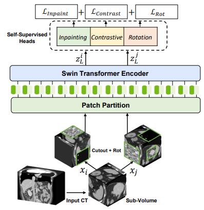
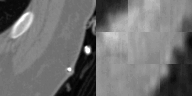

# Model Overview
This repository contains the code for self-supervised pre-training of Swin UNETR model[1] for medical image segmentation. Swin UNETR is the state-of-the-art on Medical Segmentation
Decathlon (MSD) and Beyond the Cranial Vault (BTCV) Segmentation Challenge dataset. The architecture of Swin UNETR is illustrated below:


For self-supervised pre-training, randomly cropped tokens are augmented with different transforms such as rotation and cutout and used
for pre-text tasks such as masked volume inpainting and contrastive learning and rotation. An overview of the pre-training framework is presented
in the following:



The following demonstrates an animation of original images (left) and their reconstructions (right):




# Installing Dependencies
Dependencies can be installed using:
``` bash
pip install -r requirements.txt
```

# Pre-trained Models

We provide the self-supervised pre-trained weights for Swin UNETR backbone (CVPR paper [1]) in this <a href="https://github.com/Project-MONAI/MONAI-extra-test-data/releases/download/0.8.1/model_swinvit.pt"> link</a>.
In the following, we describe steps for pre-training the model from scratch.

# Datasets

The following datasets were used for pre-training (~5050 3D CT images). Please download the corresponding the json files of each dataset for more details and place them in ```jsons``` folder:

- Head & Neck Squamous Cell Carcinoma (HNSCC) ([Link](https://wiki.cancerimagingarchive.net/display/Public/HNSCC)) ([Download json](https://github.com/Project-MONAI/MONAI-extra-test-data/releases/download/0.8.1/dataset_HNSCC_0.json))
- Lung Nodule Analysis 2016 (LUNA 16) ([Link](https://luna16.grand-challenge.org/Data/)) ([Download json](https://github.com/Project-MONAI/MONAI-extra-test-data/releases/download/0.8.1/dataset_LUNA16_0.json))
- TCIA CT Colonography Trial ([Link](https://wiki.cancerimagingarchive.net/display/Public/CT+COLONOGRAPHY/)) ([Download json](https://github.com/Project-MONAI/MONAI-extra-test-data/releases/download/0.8.1/dataset_TCIAcolon_v2_0.json))
- TCIA Covid 19 ([Link](https://wiki.cancerimagingarchive.net/display/Public/CT+Images+in+COVID-19/)) ([Download json](https://github.com/Project-MONAI/MONAI-extra-test-data/releases/download/0.8.1/dataset_TCIAcovid19_0.json))
- TCIA LIDC ([Link](https://wiki.cancerimagingarchive.net/display/Public/LIDC-IDRI/)) ([Download json](https://github.com/Project-MONAI/MONAI-extra-test-data/releases/download/0.8.1/dataset_LIDC_0.json))


# Training

## Distributed Multi-GPU Pre-Training

To pre-train a `Swin UNETR` encoder using multi-gpus:

```bash
python -m torch.distributed.launch --nproc_per_node=<Num-GPUs> --master_port=11223 main.py
--batch_size=<Batch-Size> --num_steps=<Num-Steps> --lrdecay --eval_num=<Eval-Num> --logdir=<Exp-Num> --lr=<Lr>
```

The following was used to pre-train Swin UNETR on 8 X 32G V100 GPUs:

```bash
python -m torch.distributed.launch --nproc_per_node=8 --master_port=11223 main.py
--batch_size=1 --num_steps=100000 --lrdecay --eval_num=500 --lr=6e-6 --decay=0.1
```

## Single GPU Pre-Training with Gradient Check-pointing

To pre-train a `Swin UNETR` encoder using a single gpu with gradient-checkpointing and a specified patch size:

```bash
python main.py --use_checkpoint --batch_size=<Batch-Size> --num_steps=<Num-Steps> --lrdecay
--eval_num=<Eval-Num> --logdir=<Exp-Num> --lr=<Lr> --roi_x=<Roi_x> --roi_y=<Roi_y> --roi_z=<Roi_z>
```


# Citation
If you find this repository useful, please consider citing UNETR paper:

```
@inproceedings{tang2022self,
  title={Self-supervised pre-training of swin transformers for 3d medical image analysis},
  author={Tang, Yucheng and Yang, Dong and Li, Wenqi and Roth, Holger R and Landman, Bennett and Xu, Daguang and Nath, Vishwesh and Hatamizadeh, Ali},
  booktitle={Proceedings of the IEEE/CVF Conference on Computer Vision and Pattern Recognition},
  pages={20730--20740},
  year={2022}
}

@article{hatamizadeh2022swin,
  title={Swin UNETR: Swin Transformers for Semantic Segmentation of Brain Tumors in MRI Images},
  author={Hatamizadeh, Ali and Nath, Vishwesh and Tang, Yucheng and Yang, Dong and Roth, Holger and Xu, Daguang},
  journal={arXiv preprint arXiv:2201.01266},
  year={2022}
}
```

# References
[1]: Tang, Y., Yang, D., Li, W., Roth, H.R., Landman, B., Xu, D., Nath, V. and Hatamizadeh, A., 2022. Self-supervised pre-training of swin transformers for 3d medical image analysis. In Proceedings of the IEEE/CVF Conference on Computer Vision and Pattern Recognition (pp. 20730-20740).

[2]: Hatamizadeh, A., Nath, V., Tang, Y., Yang, D., Roth, H. and Xu, D., 2022. Swin UNETR: Swin Transformers for Semantic Segmentation of Brain Tumors in MRI Images. arXiv preprint arXiv:2201.01266.
