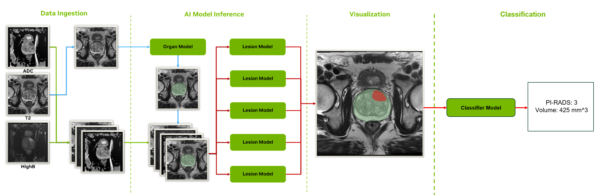

# Prostate MRI Lesion Segmentation - MONAI Deploy MAP

  

This workflow takes T2, ADC, and HighB MRI series as input and produces several NIfTI files as output. These outputs contain organ and lesion segmentations and lesion probability maps.

  
  
  

## Software and Setup

In order to run this workflow and build a MAP you will need to [install MONAI Deploy App SDK](https://docs.monai.io/projects/monai-deploy-app-sdk/en/latest/getting_started/installing_app_sdk.html). This can be installed along with all other software dependencies by running `pip install -r prostate_mri_lesion_seg_app/requirements.txt`.

It is recommended to have an NVIDIA GPU with at least 12 GB of memory available.

## Models

The models needed to build and execute the pipeline (1 organ segmentation model, 5 lesion segmentation models, 1 classification model) are hosted separately on [Google Drive here](https://drive.google.com/drive/folders/1EpjrlzEdV7CcaCYqGTIEzOapamP4Ag6M?usp=sharing).

Download these models and put them inside a folder named `prostate_mri_lesion_seg_app/models` alongside the rest of the application code. Pipeline creation and execution will not complete if the model file path is changed or renamed.

## Using this Repository

The easiest way to get started with this workflow is to run a test image taken from the [ProstateX](https://wiki.cancerimagingarchive.net/pages/viewpage.action?pageId=23691656) dataset. The `build_and_run.ipynb` file walks through this process using ProstateX-0004 which can be [downloaded separately](https://drive.google.com/drive/folders/1besSncSLlbeiv7UWveRJoOYQXOzu3JkU?usp=sharing) and placed in a `test-data/` directory.

After validating on test data, you can test this image on your own study or dataset. One of the main considerations when adapting to a new dataset will be the making sure the [DICOM Series Selector Operator](https://docs.monai.io/projects/monai-deploy-app-sdk/en/latest/modules/_autosummary/monai.deploy.operators.DICOMSeriesSelectorOperator.html#monai.deploy.operators.DICOMSeriesSelectorOperator) is configured to properly differentiate between the different naming schemes and properties of the new dataset.

If all three (T2, ADC, HighB) series are not detected properly in the study, the pipeline will not complete. If any of these modalities are incorrectly routed, the pipeline results will not be accurate. The workflow currently saves intermediate copies (in NIfTI) of these series in the output folder so it is possible to verify they were picked up (and preprocessed) correctly.

The current set of rules in `app.py` filter based on SeriesDescription, ImageType, etc., and work with ProstateX. Please refer to MONAI documentation for guidance on modifying these rules for custom filtering.

## Scripts

There are several scripts to help with validation and development included in the `scripts/` directory.

- `scripts/test_local.sh`: Execute workflow locally on test images without building a MAP.
- `scripts/test_MAP.sh`: Execute MAP workflow on test images with option to rebuild MAP.
- `scripts/compare_output.sh`: Computes organ and lesion DICE scores for two output directories.

## Publications

Several publications have leveraged this workflow either in part or in full.

Esengur, Omer Tarik, et al. ["Assessing the Impact of Transition and Peripheral Zone PSA Densities Over Whole‐Gland PSA Density for Prostate Cancer Detection on Multiparametric MRI."](https://onlinelibrary.wiley.com/doi/abs/10.1002/pros.24863) The Prostate (2025): e24863.

Yilmaz, Enis C., et al. ["External Validation of a Previously Developed Deep Learning–based Prostate Lesion Detection Algorithm on Paired External and In-House Biparametric MRI Scans."](https://pubs.rsna.org/doi/abs/10.1148/rycan.240050) Radiology: Imaging Cancer 6.6 (2024): e240050.

Lin, Yue, et al. ["Evaluation of a Cascaded deep learning–based algorithm for prostate lesion detection at biparametric MRI."](https://pubs.rsna.org/doi/abs/10.1148/radiol.230750) Radiology 311.2 (2024): e230750.

Simon, Benjamin D., et al. ["Automated detection and grading of extraprostatic extension of prostate cancer at MRI via cascaded deep learning and random forest classification."](https://www.sciencedirect.com/science/article/abs/pii/S1076633224002204) Academic Radiology 31.10 (2024): 4096-4106.

Johnson, Latrice A., et al. ["Automated prostate gland segmentation in challenging clinical cases: comparison of three artificial intelligence methods."](https://link.springer.com/article/10.1007/s00261-024-04242-7) Abdominal Radiology 49.5 (2024): 1545-1556.

## License

This work was developed by NVIDIA and the NIH National Cancer Institute (NCI). Please refer to the LICENSE for terms of use.
