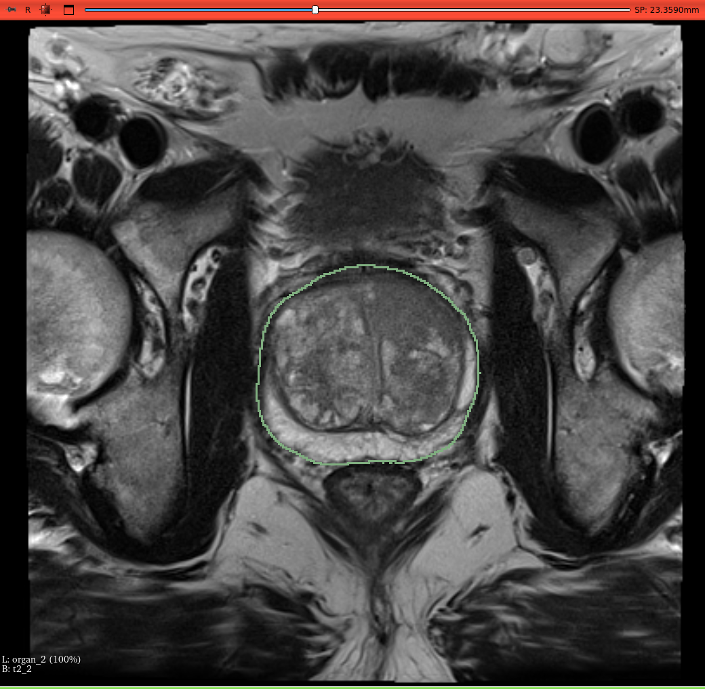
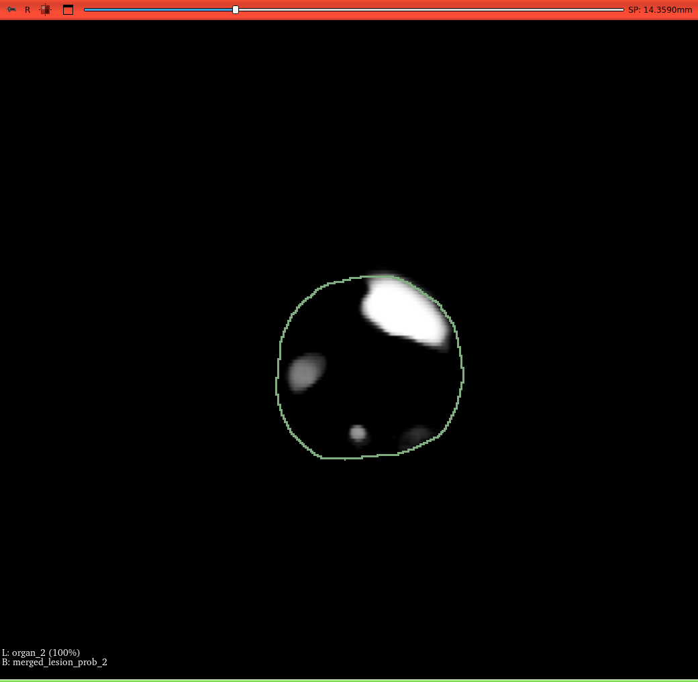
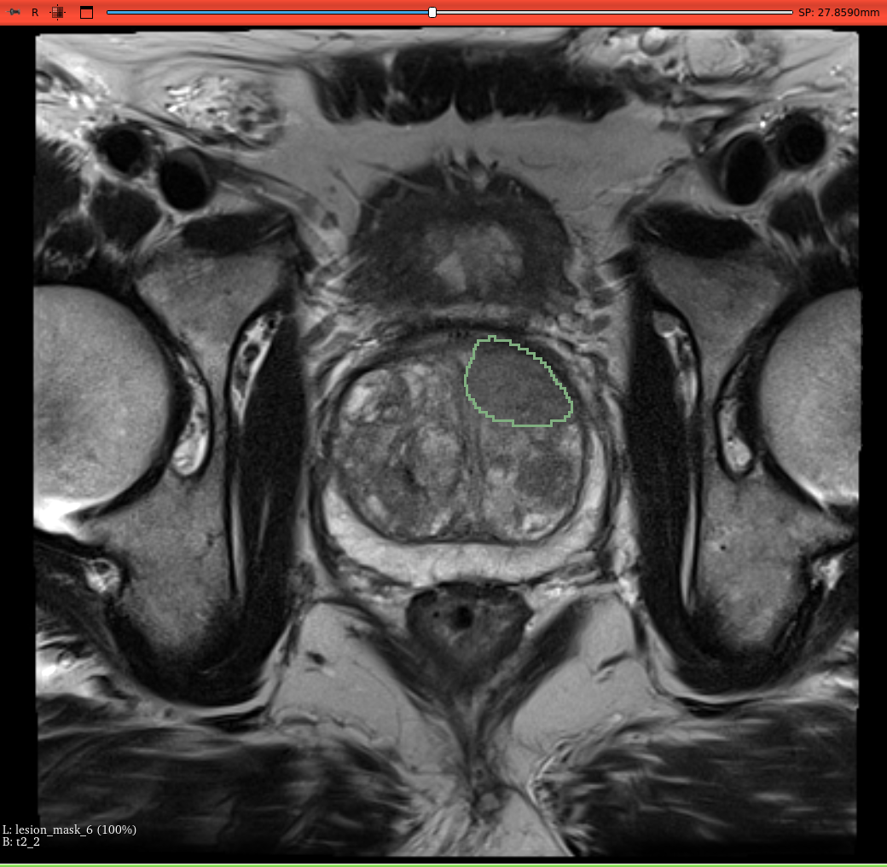

# MONAI Prostate MRI Lesion Segmentation

<p float="left">
  
  
  
</p>

## Data

This pipeline takes T2, ADC, and HighB MRI series as input and produces several NIfTI files as output. These outputs contain organ and lesion segmentations and lesion probability maps.

In order to properly ingest these three modalities, rules are created in the app.py Python file to filter based on SeriesDescription, ImageType, etc. Some example rules have been provided that work with the ProstateX dataset. Please refer to MONAI documentation for guidance on modifying these rules for custom filtering.

If any of these three of these modalities are not detected in the input folder provided, the pipeline will not execute properly.

PROSTATEx dataset:

https://wiki.cancerimagingarchive.net/pages/viewpage.action?pageId=23691656

## Models

The models needed to build and execute the pipeline (1 organ segmentation model, 5 lesion segmentation models) are hosted separately here:

https://drive.google.com/drive/folders/1wO4h5AON0MA3dxwnzl9cJlxjPxsfXcCF?usp=sharing

Download these models and put them inside a folder named prostate_mri_lesion_seg_app/models. Pipeline creation and execution not complete if the model file path is changed or renamed.

## License

This work was developed by NVIDIA and the NIH National Cancer Institute (NCI). Please refer to the LICENSE for terms of use.

## Example Output

There is a simple build_and_run.ipynb Jupyter notebook included in the repository that has two cells. The first cell will build the container and the second cell executes the container with a PROSTATEx image folder as input. Modify the input folder location to point to a directory on your local system.

```
Checking dependencies...
--> Verifying if "docker" is installed...

--> Verifying if "lesion_seg_workflow_app:latest" is available...

Checking for MAP "lesion_seg_workflow_app:latest" locally
"lesion_seg_workflow_app:latest" found.

Reading MONAI App Package manifest...
-------------------application manifest-------------------
{
    "api-version": "0.1.0",
    "command": "python3 -u /opt/monai/app/app.py",
    "environment": {},
    "input": {
        "formats": [],
        "path": "input"
    },
    "output": {
        "format": {},
        "path": "output"
    },
    "sdk-version": "0.5.1",
    "timeout": 0,
    "version": "0.5.1",
    "working-directory": "/var/monai/"
}
----------------------------------------------

-------------------package manifest-------------------
{
    "api-version": "0.1.0",
    "application-root": "/var/monai/",
    "models": [
        {
            "name": "organ-5b6bbe150488ed6e34ac61d113aeb4786ec1c4cda9bd18304f6a8a891e93e79d",
            "path": "/opt/monai/models/organ/model.ts"
        }
    ],
    "resources": {
        "cpu": 1,
        "gpu": 1,
        "memory": "7168Mi"
    },
    "sdk-version": "0.5.1",
    "version": "0.5.1"
}
----------------------------------------------

--> Verifying if "nvidia-docker" is installed...

Executing command: nvidia-docker run --rm -a STDERR -a STDOUT -e MONAI_INPUTPATH="/var/monai/input" -e MONAI_OUTPUTPATH="/var/monai/output" -e MONAI_MODELPATH=/opt/monai/models -v "/media/jtetreault/Data/Datasets/ProstateX/PROSTATEx/ProstateX-0004":"/var/monai/input" -v "/home/jtetreault/Projects/monai-projects/prostate-mri/public/output":"/var/monai/output" --shm-size=1g --entrypoint "/bin/bash" "lesion_seg_workflow_app:latest" -c "python3 -u /opt/monai/app/app.py"
Going to initiate execution of operator DICOMDataLoaderOperator
Executing operator DICOMDataLoaderOperator (Process ID: 1, Operator ID: 97060f19-0791-4878-8c03-67e14c0a3962)
Done performing execution of operator DICOMDataLoaderOperator

Going to initiate execution of operator DICOMSeriesSelectorOperator
Executing operator DICOMSeriesSelectorOperator (Process ID: 1, Operator ID: e8c3dc78-f7f1-432f-9b1a-3de5e502f8b3)
[2023-07-14 18:00:12,977] [INFO] (root) - Finding series for Selection named: t2
[2023-07-14 18:00:12,977] [INFO] (root) - Searching study, : 1.3.6.1.4.1.14519.5.2.1.7311.5101.170561193612723093192571245493
  # of series: 7
[2023-07-14 18:00:12,977] [INFO] (root) - Working on series, instance UID: 1.3.6.1.4.1.14519.5.2.1.7311.5101.278358228783511961204087191158
[2023-07-14 18:00:12,977] [INFO] (root) - On attribute: 'Modality' to match value: 'MR'
[2023-07-14 18:00:12,977] [INFO] (root) -     Series attribute Modality value: MR
[2023-07-14 18:00:12,977] [INFO] (root) - On attribute: 'ImageType' to match value: ['ORIGINAL', 'PRIMARY']
[2023-07-14 18:00:12,977] [INFO] (root) -     Series attribute ImageType value: None
[2023-07-14 18:00:12,977] [INFO] (root) - This series does not match the selection conditions.
[2023-07-14 18:00:12,977] [INFO] (root) - Working on series, instance UID: 1.3.6.1.4.1.14519.5.2.1.7311.5101.473042633347744664896320600386
[2023-07-14 18:00:12,977] [INFO] (root) - On attribute: 'Modality' to match value: 'MR'
[2023-07-14 18:00:12,977] [INFO] (root) -     Series attribute Modality value: MR
[2023-07-14 18:00:12,977] [INFO] (root) - On attribute: 'ImageType' to match value: ['ORIGINAL', 'PRIMARY']
[2023-07-14 18:00:12,977] [INFO] (root) -     Series attribute ImageType value: None
[2023-07-14 18:00:12,977] [INFO] (root) - On attribute: 'SeriesDescription' to match value: '((?=AX T2)|(?=AX T2  6 NSA)|(?=AX T2  FAST)|(?=AX T2 . voxel 7x.8)|(?=AX T2 B1 Default)|(?=AX T2 CS)|(?=AX T2 cs 3.0)|(?=AX T2 FAST)|(?=AX T2 FRFSE)|(?=AX T2 N/S)|(?=AX T2 No sense)|(?=AX T2 NS)|(?=AX T2 NSA 3)|(?=AX T2 NSA 4)|(?=AX T2 NSA 5)|(?=AX T2 PROP)|(?=Ax T2 PROSTATE)|(?=AX T2 SMALL FOV)|(?=Ax T2 thin FRFSE)|(?=sT2 TSE ax no post)|(?=T2 AX)|(?=T2 AX SMALL FOV[*]? IF MOTION REPEAT[*]?)|(?=T2 AXIAL 3MM)|(?=T2 TRA 3mm)|(?=T2 TSE Ax)|(?=T2 TSE ax cs)|(?=T2 TSE ax hi)|(?=T2 TSE ax hi sense)|(?=T2 TSE ax no sense)|(?=T2 TSE ax NS)|(?=T2 TSE ax NSA 3)|(?=t2_tse_tra)|(?=t2_tse_tra_320_p2)|(?=t2_tse_tra_3mm _SFOV_TE 92)|(?=t2_tse_tra_Grappa3)|(?=T2W_TSE)|(?=T2W_TSE_ax)|(?=T2W_TSE_ax PSS Refoc 52)|(?=T2W_TSE_ax zoom PSS Refoc))'
[2023-07-14 18:00:12,978] [INFO] (root) -     Series attribute SeriesDescription value: t2_tse_sag
[2023-07-14 18:00:12,978] [INFO] (root) - Series attribute string value did not match. Try regEx.
[2023-07-14 18:00:12,980] [INFO] (root) - This series does not match the selection conditions.
[2023-07-14 18:00:12,980] [INFO] (root) - Working on series, instance UID: 1.3.6.1.4.1.14519.5.2.1.7311.5101.206828891270520544417996275680
[2023-07-14 18:00:12,980] [INFO] (root) - On attribute: 'Modality' to match value: 'MR'
[2023-07-14 18:00:12,980] [INFO] (root) -     Series attribute Modality value: MR
[2023-07-14 18:00:12,980] [INFO] (root) - On attribute: 'ImageType' to match value: ['ORIGINAL', 'PRIMARY']
[2023-07-14 18:00:12,980] [INFO] (root) -     Series attribute ImageType value: None
[2023-07-14 18:00:12,980] [INFO] (root) - On attribute: 'SeriesDescription' to match value: '((?=AX T2)|(?=AX T2  6 NSA)|(?=AX T2  FAST)|(?=AX T2 . voxel 7x.8)|(?=AX T2 B1 Default)|(?=AX T2 CS)|(?=AX T2 cs 3.0)|(?=AX T2 FAST)|(?=AX T2 FRFSE)|(?=AX T2 N/S)|(?=AX T2 No sense)|(?=AX T2 NS)|(?=AX T2 NSA 3)|(?=AX T2 NSA 4)|(?=AX T2 NSA 5)|(?=AX T2 PROP)|(?=Ax T2 PROSTATE)|(?=AX T2 SMALL FOV)|(?=Ax T2 thin FRFSE)|(?=sT2 TSE ax no post)|(?=T2 AX)|(?=T2 AX SMALL FOV[*]? IF MOTION REPEAT[*]?)|(?=T2 AXIAL 3MM)|(?=T2 TRA 3mm)|(?=T2 TSE Ax)|(?=T2 TSE ax cs)|(?=T2 TSE ax hi)|(?=T2 TSE ax hi sense)|(?=T2 TSE ax no sense)|(?=T2 TSE ax NS)|(?=T2 TSE ax NSA 3)|(?=t2_tse_tra)|(?=t2_tse_tra_320_p2)|(?=t2_tse_tra_3mm _SFOV_TE 92)|(?=t2_tse_tra_Grappa3)|(?=T2W_TSE)|(?=T2W_TSE_ax)|(?=T2W_TSE_ax PSS Refoc 52)|(?=T2W_TSE_ax zoom PSS Refoc))'
[2023-07-14 18:00:12,980] [INFO] (root) -     Series attribute SeriesDescription value: t2_tse_tra
[2023-07-14 18:00:12,980] [INFO] (root) - Series attribute string value did not match. Try regEx.
[2023-07-14 18:00:12,980] [INFO] (root) - Selected Series, UID: 1.3.6.1.4.1.14519.5.2.1.7311.5101.206828891270520544417996275680
Done performing execution of operator DICOMSeriesSelectorOperator

Going to initiate execution of operator DICOMSeriesSelectorOperator
Executing operator DICOMSeriesSelectorOperator (Process ID: 1, Operator ID: 2d93078a-3cb8-4db2-afa3-9882273e261f)
[2023-07-14 18:00:12,981] [INFO] (root) - Finding series for Selection named: adc
[2023-07-14 18:00:12,981] [INFO] (root) - Searching study, : 1.3.6.1.4.1.14519.5.2.1.7311.5101.170561193612723093192571245493
  # of series: 7
[2023-07-14 18:00:12,981] [INFO] (root) - Working on series, instance UID: 1.3.6.1.4.1.14519.5.2.1.7311.5101.278358228783511961204087191158
[2023-07-14 18:00:12,981] [INFO] (root) - On attribute: 'Modality' to match value: 'MR'
[2023-07-14 18:00:12,981] [INFO] (root) -     Series attribute Modality value: MR
[2023-07-14 18:00:12,981] [INFO] (root) - On attribute: 'ImageType' to match value: ['DIFFUSION', 'ADC']
[2023-07-14 18:00:12,981] [INFO] (root) -     Series attribute ImageType value: None
[2023-07-14 18:00:12,981] [INFO] (root) - On attribute: 'SeriesDescription' to match value: '((?=ADC (10^-6 mm²/s))|(?=Apparent Diffusion Coefficient (mm2/s))|(?=AX DIFFUSION_ADC_DFC_MIX)|(?=.*AX DWI (50,1500)_ADC.*)|(?=AX DWI_ADC_DFC_MIX)|(?=b_1500 prostate_ADC)|(?=b_2000 prostate_ADC)|(?=d3B ADC 3B 750  ERC SSh_DWI FAST SENSE)|(?=dADC)|(?=dADC 0_1500)|(?=dADC 100 400 600)|(?=dADC 2)|(?=dADC 3)|(?=dADC ALL)|(?=dADC b 0 1000 2000)|(?=dADC from 0_1500)|(?=dADC from b0_600)|(?=dADC from B0-1500)|(?=dADC Map)|(?=dADC map 1)|(?=dADC MAP 2)|(?=dADC_1 axial)|(?=dADC_b375_750_1150)|(?=ddADC MAP)|(?=DIFF bv1400_ADC)|(?=diff tra b 50 500 800 WIP511b alle spoelen_ADC)|(?=diffusie-3Scan-4bval_fs_ADC)|(?=dReg - WIP SSh_DWI FAST SENSE)|(?=dSSh_DWI SENSE)|(?=DWI PROSTATE_ADC)|(?=dWIP 3B 600 w ERC SSh_DWI S2Ovs2)|(?=dWIP 3B ADC 3B 600 w/o ERC SSh_DWI FAST SENSE)|(?=dWIP SSh_DWI FAST SENSE)|(?=ep2d_diff_new 16 measipat_ADC)|(?=ep2d_DIFF_tra_b50_500_800_1400_alle_spoelen_ADC)|(?=ep2d_diff_tra_DYNDIST_ADC)|(?=ep2d_diff_tra_DYNDIST_MIX_ADC)|(?=ep2d_diff_tra2x2_Noise0_FS_DYNDIST_ADC)|(?=ep2d-advdiff-3Scan-4bval_spair_511b_ADC))'
[2023-07-14 18:00:12,981] [INFO] (root) -     Series attribute SeriesDescription value: ep2d_diff_tra_DYNDIST_MIX_ADC
[2023-07-14 18:00:12,981] [INFO] (root) - Series attribute string value did not match. Try regEx.
[2023-07-14 18:00:12,984] [INFO] (root) - Selected Series, UID: 1.3.6.1.4.1.14519.5.2.1.7311.5101.278358228783511961204087191158
Done performing execution of operator DICOMSeriesSelectorOperator

Going to initiate execution of operator DICOMSeriesSelectorOperator
Executing operator DICOMSeriesSelectorOperator (Process ID: 1, Operator ID: d131a38f-8ec1-4043-a5b1-0511f61d031c)
[2023-07-14 18:00:12,985] [INFO] (root) - Finding series for Selection named: highb
[2023-07-14 18:00:12,985] [INFO] (root) - Searching study, : 1.3.6.1.4.1.14519.5.2.1.7311.5101.170561193612723093192571245493
  # of series: 7
[2023-07-14 18:00:12,985] [INFO] (root) - Working on series, instance UID: 1.3.6.1.4.1.14519.5.2.1.7311.5101.278358228783511961204087191158
[2023-07-14 18:00:12,985] [INFO] (root) - On attribute: 'Modality' to match value: 'MR'
[2023-07-14 18:00:12,985] [INFO] (root) -     Series attribute Modality value: MR
[2023-07-14 18:00:12,985] [INFO] (root) - On attribute: 'ImageType' to match value: ['DIFFUSION', 'TRACEW']
[2023-07-14 18:00:12,985] [INFO] (root) -     Series attribute ImageType value: None
[2023-07-14 18:00:12,985] [INFO] (root) - This series does not match the selection conditions.
[2023-07-14 18:00:12,985] [INFO] (root) - Working on series, instance UID: 1.3.6.1.4.1.14519.5.2.1.7311.5101.473042633347744664896320600386
[2023-07-14 18:00:12,985] [INFO] (root) - On attribute: 'Modality' to match value: 'MR'
[2023-07-14 18:00:12,985] [INFO] (root) -     Series attribute Modality value: MR
[2023-07-14 18:00:12,985] [INFO] (root) - On attribute: 'ImageType' to match value: ['DIFFUSION', 'TRACEW']
[2023-07-14 18:00:12,986] [INFO] (root) -     Series attribute ImageType value: None
[2023-07-14 18:00:12,986] [INFO] (root) - This series does not match the selection conditions.
[2023-07-14 18:00:12,986] [INFO] (root) - Working on series, instance UID: 1.3.6.1.4.1.14519.5.2.1.7311.5101.206828891270520544417996275680
[2023-07-14 18:00:12,986] [INFO] (root) - On attribute: 'Modality' to match value: 'MR'
[2023-07-14 18:00:12,986] [INFO] (root) -     Series attribute Modality value: MR
[2023-07-14 18:00:12,986] [INFO] (root) - On attribute: 'ImageType' to match value: ['DIFFUSION', 'TRACEW']
[2023-07-14 18:00:12,986] [INFO] (root) -     Series attribute ImageType value: None
[2023-07-14 18:00:12,986] [INFO] (root) - This series does not match the selection conditions.
[2023-07-14 18:00:12,986] [INFO] (root) - Working on series, instance UID: 1.3.6.1.4.1.14519.5.2.1.7311.5101.212145009248667341607386363070
[2023-07-14 18:00:12,986] [INFO] (root) - On attribute: 'Modality' to match value: 'MR'
[2023-07-14 18:00:12,986] [INFO] (root) -     Series attribute Modality value: MR
[2023-07-14 18:00:12,986] [INFO] (root) - On attribute: 'ImageType' to match value: ['DIFFUSION', 'TRACEW']
[2023-07-14 18:00:12,986] [INFO] (root) -     Series attribute ImageType value: None
[2023-07-14 18:00:12,986] [INFO] (root) - This series does not match the selection conditions.
[2023-07-14 18:00:12,986] [INFO] (root) - Working on series, instance UID: 1.3.6.1.4.1.14519.5.2.1.7311.5101.196637652681902975508118013414
[2023-07-14 18:00:12,986] [INFO] (root) - On attribute: 'Modality' to match value: 'MR'
[2023-07-14 18:00:12,986] [INFO] (root) -     Series attribute Modality value: MR
[2023-07-14 18:00:12,987] [INFO] (root) - On attribute: 'ImageType' to match value: ['DIFFUSION', 'TRACEW']
[2023-07-14 18:00:12,987] [INFO] (root) -     Series attribute ImageType value: None
[2023-07-14 18:00:12,987] [INFO] (root) - On attribute: 'SeriesDescription' to match value: '((?=3B 2000 w ERC SSh_DWI)|(?=AX DIFFUSION_CALC_BVAL_DFC_MIX)|(?=AX DWI)|(?=.*AX DWI (50,1500).*)|(?=Ax DWI BH)|(?=AX DWI_TRACEW_DFC_MIX)|(?=Axial FOCUS DWI 1400)|(?=b_1500 prostate)|(?=b_2000 prostate)|(?=DIFF bv1400)|(?=diff tra b 50 500 800 WIP511b alle spoelenCALC_BVAL)|(?=diffusie-3Scan-4bval_fsCALC_BVAL)|(?=DW_Synthetic: Ax DWI All B-50-800 Synthetic B-1400)|(?=.*DW_Synthetic: Ax Focus 50,500,800,1400,2000.*)|(?=DWI PROSTATE)|(?=DWI_5b_0_1500)|(?=DWI_b2000)|(?=DWI_b2000_new)|(?=DWI_b2000_new SENSE)|(?=DWI_b2000_NSA6 SENSE)|(?=ep2d_diff_b1400_new 32 measipat)|(?=ep2d_diff_tra_DYNDIST_MIXCALC_BVAL$)|(?=ep2d_diff_tra_DYNDISTCALC_BVAL)|(?=ep2d_diff_tra2x2_Noise0_FS_DYNDISTCALC_BVAL)|(?=ep2d-advdiff-3Scan-high bvalue 1400)|(?=sb_1500)|(?=sb_2000)|(?=sB1400)|(?=sb1500)|(?=sb-1500)|(?=sb1500 r5 only)|(?=sb-2000)|(?=sDWI_b_2000)|(?=sDWI_b2000))'
[2023-07-14 18:00:12,987] [INFO] (root) -     Series attribute SeriesDescription value: ep2d_diff_tra_DYNDIST_MIX
[2023-07-14 18:00:12,987] [INFO] (root) - Series attribute string value did not match. Try regEx.
[2023-07-14 18:00:12,989] [INFO] (root) - This series does not match the selection conditions.
[2023-07-14 18:00:12,989] [INFO] (root) - Working on series, instance UID: 1.3.6.1.4.1.14519.5.2.1.7311.5101.154156364083745277068656620138
[2023-07-14 18:00:12,989] [INFO] (root) - On attribute: 'Modality' to match value: 'MR'
[2023-07-14 18:00:12,989] [INFO] (root) -     Series attribute Modality value: MR
[2023-07-14 18:00:12,990] [INFO] (root) - On attribute: 'ImageType' to match value: ['DIFFUSION', 'TRACEW']
[2023-07-14 18:00:12,990] [INFO] (root) -     Series attribute ImageType value: None
[2023-07-14 18:00:12,990] [INFO] (root) - On attribute: 'SeriesDescription' to match value: '((?=3B 2000 w ERC SSh_DWI)|(?=AX DIFFUSION_CALC_BVAL_DFC_MIX)|(?=AX DWI)|(?=.*AX DWI (50,1500).*)|(?=Ax DWI BH)|(?=AX DWI_TRACEW_DFC_MIX)|(?=Axial FOCUS DWI 1400)|(?=b_1500 prostate)|(?=b_2000 prostate)|(?=DIFF bv1400)|(?=diff tra b 50 500 800 WIP511b alle spoelenCALC_BVAL)|(?=diffusie-3Scan-4bval_fsCALC_BVAL)|(?=DW_Synthetic: Ax DWI All B-50-800 Synthetic B-1400)|(?=.*DW_Synthetic: Ax Focus 50,500,800,1400,2000.*)|(?=DWI PROSTATE)|(?=DWI_5b_0_1500)|(?=DWI_b2000)|(?=DWI_b2000_new)|(?=DWI_b2000_new SENSE)|(?=DWI_b2000_NSA6 SENSE)|(?=ep2d_diff_b1400_new 32 measipat)|(?=ep2d_diff_tra_DYNDIST_MIXCALC_BVAL$)|(?=ep2d_diff_tra_DYNDISTCALC_BVAL)|(?=ep2d_diff_tra2x2_Noise0_FS_DYNDISTCALC_BVAL)|(?=ep2d-advdiff-3Scan-high bvalue 1400)|(?=sb_1500)|(?=sb_2000)|(?=sB1400)|(?=sb1500)|(?=sb-1500)|(?=sb1500 r5 only)|(?=sb-2000)|(?=sDWI_b_2000)|(?=sDWI_b2000))'
[2023-07-14 18:00:12,990] [INFO] (root) -     Series attribute SeriesDescription value: ep2d_diff_tra_DYNDIST_MIXCALC_BVAL
[2023-07-14 18:00:12,990] [INFO] (root) - Series attribute string value did not match. Try regEx.
[2023-07-14 18:00:12,990] [INFO] (root) - Selected Series, UID: 1.3.6.1.4.1.14519.5.2.1.7311.5101.154156364083745277068656620138
Done performing execution of operator DICOMSeriesSelectorOperator

Going to initiate execution of operator DICOMSeriesToVolumeOperator
Executing operator DICOMSeriesToVolumeOperator (Process ID: 1, Operator ID: 23b324da-3d36-4957-aaa5-e041503a1256)
Done performing execution of operator DICOMSeriesToVolumeOperator

Going to initiate execution of operator DICOMSeriesToVolumeOperator
Executing operator DICOMSeriesToVolumeOperator (Process ID: 1, Operator ID: 4c2361c8-4bb4-40ea-ac81-a4c5b6126723)
Done performing execution of operator DICOMSeriesToVolumeOperator

Going to initiate execution of operator DICOMSeriesToVolumeOperator
Executing operator DICOMSeriesToVolumeOperator (Process ID: 1, Operator ID: 73d15d7b-14ab-4f00-8a2d-97d1c2a3b4aa)
Done performing execution of operator DICOMSeriesToVolumeOperator

Going to initiate execution of operator ProstateSegOperator
Executing operator ProstateSegOperator (Process ID: 1, Operator ID: a9098797-8e12-4db2-9c48-1e0ab4c4d4b3)
/root/.local/lib/python3.8/site-packages/monai/utils/deprecate_utils.py:321: FutureWarning: monai.transforms.io.dictionary LoadImaged.__init__:image_only: Current default value of argument `image_only=False` has been deprecated since version 1.1. It will be changed to `image_only=True` in version 1.3.
  warn_deprecated(argname, msg, warning_category)
Converted Image object metadata:
SeriesInstanceUID: 1.3.6.1.4.1.14519.5.2.1.7311.5101.206828891270520544417996275680, type <class 'str'>
SeriesDate: 20111018, type <class 'str'>
SeriesTime: 115341.437000, type <class 'str'>
Modality: MR, type <class 'str'>
SeriesDescription: t2_tse_tra, type <class 'str'>
PatientPosition: FFS, type <class 'str'>
SeriesNumber: 5, type <class 'int'>
row_pixel_spacing: 0.5, type <class 'float'>
col_pixel_spacing: 0.5, type <class 'float'>
depth_pixel_spacing: 4.244812427751082, type <class 'float'>
row_direction_cosine: [1.0, -1.99011e-10, 4.9619e-11], type <class 'list'>
col_direction_cosine: [2.051034e-10, 0.97029572703367, -0.2419218925608], type <class 'list'>
depth_direction_cosine: [1.4080733701821592e-17, 0.2419218925608, 0.97029572703367], type <class 'list'>
dicom_affine_transform: [[ 5.00000000e-01  1.02551700e-10  0.00000000e+00 -1.17913254e+02]
 [-9.95055000e-11  4.85147864e-01  1.08864853e+00 -8.51499185e+01]
 [ 2.48095000e-11 -1.20960946e-01  4.36633089e+00  1.28399916e+01]
 [ 0.00000000e+00  0.00000000e+00  0.00000000e+00  1.00000000e+00]], type <class 'numpy.ndarray'>
nifti_affine_transform: [[-5.00000000e-01 -1.02551700e-10 -0.00000000e+00  1.17913254e+02]
 [ 9.95055000e-11 -4.85147864e-01 -1.08864853e+00  8.51499185e+01]
 [ 2.48095000e-11 -1.20960946e-01  4.36633089e+00  1.28399916e+01]
 [ 0.00000000e+00  0.00000000e+00  0.00000000e+00  1.00000000e+00]], type <class 'numpy.ndarray'>
StudyInstanceUID: 1.3.6.1.4.1.14519.5.2.1.7311.5101.170561193612723093192571245493, type <class 'str'>
StudyID: , type <class 'str'>
StudyDate: 20111018, type <class 'str'>
StudyTime: 113950.828000, type <class 'str'>
StudyDescription: MR prostaat kanker detectie WDS_mc MCAPRODETW, type <class 'str'>
AccessionNumber: 1566645557835538, type <class 'str'>
selection_name: t2, type <class 'str'>
[2023-07-14 18:00:13,102] [INFO] (Loaded image) - Data statistics:
Type: <class 'monai.data.meta_tensor.MetaTensor'> torch.float32
Shape: torch.Size([384, 384, 19])
Value range: (0.0, 1432.0)
[2023-07-14 18:00:13,103] [INFO] (Channel-first image) - Data statistics:
Type: <class 'monai.data.meta_tensor.MetaTensor'> torch.float32
Shape: torch.Size([1, 384, 384, 19])
Value range: (0.0, 1432.0)
[2023-07-14 18:00:13,431] [INFO] (Resampled and normalized image) - Data statistics:
Type: <class 'monai.data.meta_tensor.MetaTensor'> torch.float32
Shape: torch.Size([1, 192, 193, 82])
Value range: (-1.5098271369934082, 6.934866905212402)
[2023-07-14 18:00:17,637] [INFO] (Model output) - Data statistics:
Type: <class 'monai.data.meta_tensor.MetaTensor'> torch.float32
Shape: torch.Size([2, 192, 193, 82])
Value range: (3.5554152955086238e-09, 1.0)
[2023-07-14 18:00:17,656] [INFO] (Inverted output) - Data statistics:
Type: <class 'monai.data.meta_tensor.MetaTensor'> torch.float32
Shape: torch.Size([2, 384, 384, 19])
Value range: (4.7424646432148165e-09, 1.0)
[2023-07-14 18:00:17,657] [INFO] (AsDiscrete output) - Data statistics:
Type: <class 'monai.data.meta_tensor.MetaTensor'> torch.float32
Shape: torch.Size([1, 384, 384, 19])
Value range: (0.0, 1.0)
Output Seg image numpy array shaped: (19, 384, 384)
Output Seg image pixel max value: 1
Output Seg image pixel min value: 0
Done performing execution of operator ProstateSegOperator

Going to initiate execution of operator CustomProstateLesionSegOperator
Executing operator CustomProstateLesionSegOperator (Process ID: 1, Operator ID: 7a2d861d-0c77-4764-a5e3-5eb5796038bf)
2023-07-14 18:00:17,683 INFO image_writer.py:197 - writing: /var/monai/output/t2/t2.nii.gz
2023-07-14 18:00:18,023 INFO image_writer.py:197 - writing: /var/monai/output/adc/adc.nii.gz
2023-07-14 18:00:18,044 INFO image_writer.py:197 - writing: /var/monai/output/highb/highb.nii.gz
2023-07-14 18:00:18,063 INFO image_writer.py:197 - writing: /var/monai/output/organ/organ.nii.gz
Loading input...
Pre-processing input image...
inputs_shape: (206, 187, 170)
output filename: /var/monai/output/lesion/fold0_lesion_prob.nii.gz
output filename: /var/monai/output/lesion/fold1_lesion_prob.nii.gz
output filename: /var/monai/output/lesion/fold2_lesion_prob.nii.gz
output filename: /var/monai/output/lesion/fold3_lesion_prob.nii.gz
output filename: /var/monai/output/lesion/fold4_lesion_prob.nii.gz
Done performing execution of operator CustomProstateLesionSegOperator
```
